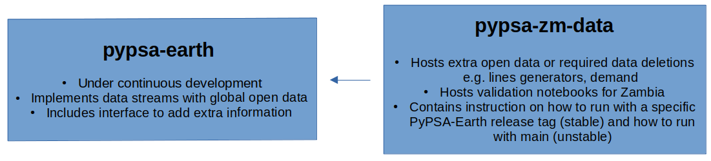

# pypsa-zm-data

This repository mainly hosts data required to run energy system planning scenarions for Zambia within [PyPSA-Earth](https://github.com/pypsa-meets-earth/pypsa-earth). Hence, it is not a standalone repository, and needs to be executed in conjunction with PyPSA-Earth.

 It also contains customised pieces of code to run those scenarios, instructions on how to run them, and validation notebooks for Zambia.

# Model Execution

## Combining pypsa-earth and pypsa-zm-data repositories

The provided workflow builds on [PyPSA-Earth](https://github.com/pypsa-meets-earth/pypsa-earth). Therefore, first, the PyPSA-Earth repository must be forked and the fork should then be cloned. A fork can be created by navigating to the [PyPSA-Earth](https://github.com/pypsa-meets-earth/pypsa-earth) website. By clicking on the fork-symbol in the upper right corner, a fork is created and linked to the specific user.

Next, we also need to fork the [pypsa-zm-data](https://github.com/pypsa-meets-earth/pypsa-zm-data) repository. A fork can be created by navigating to the [pypsa-zm-data](https://github.com/pypsa-meets-earth/pypsa-zm-data) website and clicking the fork symbol in the upper right corner.

To clone both forks to the correct locations on a local machine, the following commands can be used using the local machines shell:
```bash
git clone https://github.com/<user-name>/pypsa-earth
```
`<user-name>` must be replaced with the personal github-username.

After that, one must change to the freshly created pypsa-earth repository.
```bash
cd pypsa-earth/
```
and repeat the cloning, this time for the pypsa-kz-data repository.
```bash
git clone https://github.com/<user-name>/pypsa-kz-data
```
Again, `<user-name>` must be replaced with the personal github-username. At the end of this process, the following folder structure should have been created (where `<user-name>` is your personal github-username):

- `../<user-name>/pypsa-earth` that contains the pypsa-earth repository.

- `../<user-name>/pypsa-earth/pypsa-zm-data` that contains the pypsa-zm-data repository. Note that this is inside the main directory of the pypsa-earth repository.

In order to install the pypsa-earth environment, instructions are provided in the pypsa-earth [documentation](https://pypsa-earth.readthedocs.io/en/latest/installation.html), see `Install dependencies` and `Python dependencies`. Note that you should be in the directory `../<user-name>/pypsa-earth` at the beginning this process.
After installing the environment, activate it using
```bash
conda activate pypsa-earth
```
Before the whole workflow can be executed, the databundle must be retrieved. This can be done via:
```bash
snakemake -j 1 retrieve_databundle_light
```
This step can optionally be skipped if the `data/` folder with all relevant subfolders already exists.

## Feeding pypsa-earth with customized data from pypsa-zm-data (work in progress, not yet functional)

To adapt the overall workflow for kz, only three further changes are necessary:
1. replace the `pypsa-earth/data/custom_powerplants.csv` with the provided `pypsa-kz-data/data/custom_powerplants.csv`. This can be done using the command:
```bash
cp pypsa-kz-data/data/custom_powerplants.csv data/custom_powerplants.csv
```

2. Open the Snakefile (in `pypsa-earth/`) and navigate to line 25, which should read `configfile: "config.yaml"`. Replace this line with `configfile: "pypsa-kz-data/config_kz_default.yaml"`. To run the default scenario for different weather years (2011, 2013, 2018), add a new line below (line 26) with `configfile: "pypsa-kz-data/config_kz_<year>.yaml"`, where `<year>` represents an existing weather year (2011, 2013, 2018).

The whole workflow can be reproduced by executing
```bash
snakemake -j 1 solve_everything
```

3. Only for scenarios: To run a certain scenario, make sure to update the *2nd* config file, i.e. navigate to line 26 in the Snakefile, which now should read: `configfile: "pypsa-kz-data/config_kz_<year>.yaml"` and replace this with the scenario you want to execute: `configfile: "pypsa-kz-data/config_kz_<year>_discount<p>.yaml"`. `<year>` and `<p>` must be replaced with existing years (2011, 2013, 2018) and discount rates (10 for optimistic scenario, 15 for BAU and 20 for pessimistic scenario). To run the coal exit scenario, the corresponding config file also must be referred in line 26 of the `Snakemake`. For this setting, the line must read `configfile: "pypsa-kz-data/config_kz_<year>_discount<p>_coalexit.yaml"`, where `<year>` and `<p>` are the weather year (2011, 2013, 2018) and discount rates (10, 15, and 20).

Again, the whole workflow can be reproduced by executing the same command as above:
```bash
snakemake -j 1 solve_everything
```

Results are generated and locally saved in `pypsa-earth/results/<scenario_folder>/networks/`.

## Potential errors (work in progress)
:
- A rule is killed. In this case, open the `Snakefile` in `pypsa-earth` or open `kz.smk` in `pypsa-kz-data` (depending on the rule which is killed), navigate to the rule that is being killed in the workflow and increase the memory assignment (for example, add a 0 at the end).

- The workflow runs into an error during the `build_powerplants` rule. In this case, try to repeat step 1. of the workflow using the command
```bash
cp pypsa-kz-data/data/custom_powerplants.csv data/custom_powerplants.csv
```

- Unusual error arising from either Snakemake or the `Snakefile` and proving to be challenging to comprehend: Inspect all indentation. Ensure there is no tab spacing; employ only spaces, i.e., ` `. It is probable that the indentations before `configfile: 'pypsa-kz-data/config_kz_<...>.yaml'` are tabs instead of four spaces.

## Comes in handy:
After all cutouts were generated (i.e. the three files `asia-<year>-era5.nc` exist in the folder `pypsa-earth/cutouts/`, where `<year>` is 2011, 2013, and 2018, navigate to `pypsa-earth/pypsa-kz-data`, open the default config file, navigate to line 36, which should read `build_cutout: True`, and set it to `build_cutout: false`. This will save you a lot of time when (re-)runnig scenarios. But remember to set it back to `true` in case one of the cutouts was deleted!



# Repository Structure

## `configs` folder

The `configs` folder contains `config.yaml's` for all scenarios. These are the option files that allow `pypsa-earth` to create model outputs.

## `data` folder

The `data` folder contains any extra data or data deletion requirements.

## `image` folder

The `image` folder contains all images used in this repository.

## `scripts` folder

The `scripts` folder contains the source code required to execute Snakemake rules that are specific for Zambia. The execution of these rules is controlled by the Snakefile `zm.smk` (see below).

## `validation` folder

The `validation` folder contains all the resources used to validate the PyPSA-Earth in Zambia. It is divided in two subfolders:

1. `notebooks` contains modified versions of the validation notebook template given in the [pypsa-earth/documentation](https://github.com/pypsa-meets-earth/documentation/tree/main/notebooks/validation) for Zambia.

2. `report` contains a report, written in paper format, of the model validation for Zambia. It is inspired in section 4 of the PyPSA-Earth paper ([Parzen et al. (2023)](https://doi.org/10.1016/j.apenergy.2023.121096)). For now, the most updated version of the report is stored in Overleaf, and can be edited through the following [link](https://www.overleaf.com/9955214172jymhghfymjrx). The version in this repository will be updated regularly from Overleaf.

Beyond the templates used, the validation of PyPSA-Earth in Zambia focuses on key features of the Zambian electricity system (e.g., hydro).

## Snakefile `zm.smk`

The Snakefile `zm.smk` defines the Snakemake rules that are specific for Zambia.

Note that the code to execute those rules should be stored in the `scripts` folder, and called as a script in the Snakefile `zm.smk`. 

# User Instructions

TBD. This [issue](https://github.com/pypsa-meets-earth/pypsa-zm-data/issues/1) needs to be solved/ tested.

# Acknowledgement

Both projects are funded by the Climate Compatible Growth for the following projects:

- [Macroeconomic implications of the Green Growth Strategy in Zambia](https://drive.google.com/file/d/1n9l50KhCGH4l07Kqsu1wiRGweubw0TYj/view?usp=sharing)
- [Energy System Chef – The energy system implications of transitions to clean cooking in Zambia](https://drive.google.com/file/d/1Sgr3NXm2F5gEFea_qEvJ-OWaNmSAjHMx/view?usp=sharing)
